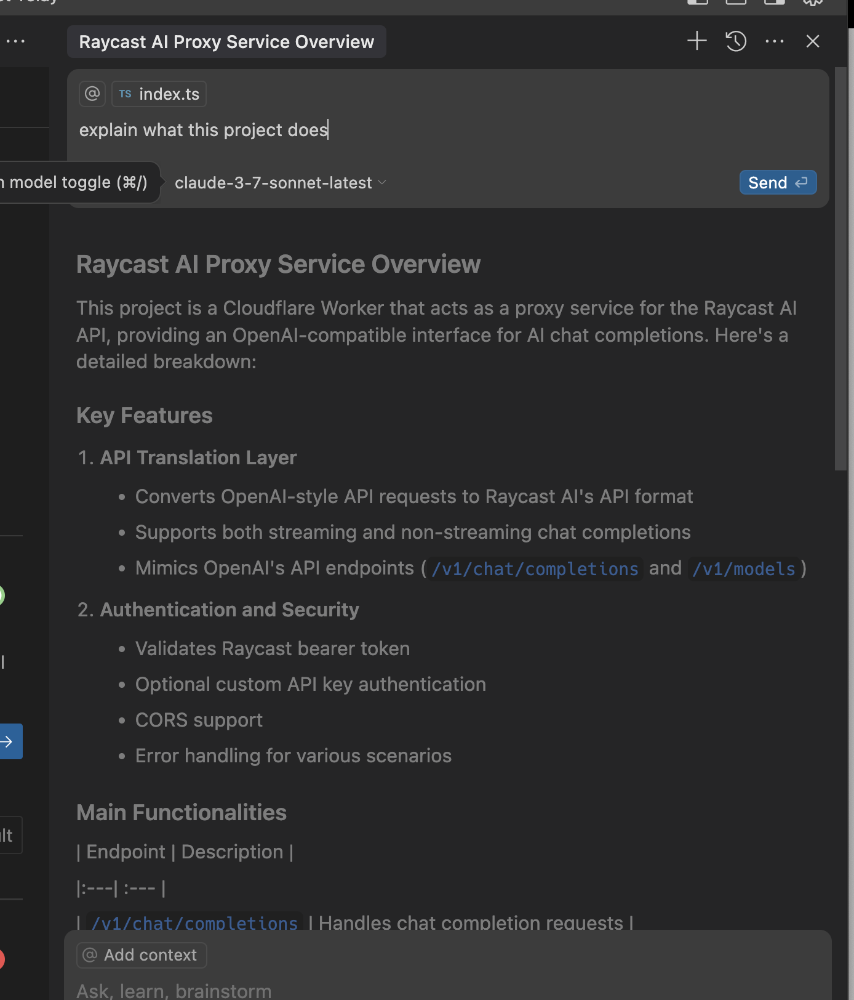

# Raycast Relay for Cloudflare Workers

- [Setup](#setup)
- [Usage](#usage)
- [Use with Cursor](#use-with-cursor)
- [Available Models](#available-models)

This project provides a relay server that allows you to use Raycast AI models through an OpenAI-compatible API interface, deployed as a Cloudflare Worker.

## Deployment

### One-Click Deployment (Recommended)

1. Get your Raycast AI Token in the step 1 below
2. Deploy
3. Add `RAYCAST_BEARER_TOKEN` in Settings -> Domain & Routes -> Variables and Secrets. You can optionally add a `API_KEY`, `ADVANCED`, `INCLUDE_DEPRECATED`. Follow the guide below

[](https://deploy.workers.cloudflare.com/?url=https://github.com/szcharlesji/raycast-relay)

### Prerequisites

- [Node.js](https://nodejs.org/)
- [Wrangler CLI](https://developers.cloudflare.com/workers/wrangler/install-and-update/)
- Cloudflare account
- Raycast API credential (Bearer token)
- HTTP Debug Tool like Proxyman or Charles on macOS

### Setup

1. Get your Raycast AI Token

Proxyman: Add raycast to your SSL proxying list, resend a request to AI. You will see a request like in the photo below: Copy the API key after Authorization Bearer.


2. Clone this repository

```bash
git clone https://github.com/szcharlesji/raycast-relay
cd raycast-relay
```

3. Install dependencies:

```bash
npm install
```

3. Configure your environment variables:

```bash
# Install wrangler
npm install -g wrangler

# Set your Raycast credentials as secrets
wrangler secret put RAYCAST_BEARER_TOKEN

# Optionally set an API key for authentication, if you want to use it with cursor, follow the cursor setup
wrangler secret put API_KEY

# Optionally set to filter out the advanced AI options if you don't have the subscription.
wrangler secret put ADVANCED

# Optionall set to include deprecated models
wrangler secret put INCLUDE_DEPRECATED
```

4. Deploy to Cloudflare Workers:

```bash
npm run deploy
```

## Usage

Once deployed, you can use the worker as an OpenAI-compatible API endpoint:

```
https://your-worker-name.your-account.workers.dev/v1
```

### API Endpoints

- `GET /v1/models` - List available models
- `POST /v1/chat/completions` - Create a chat completion
- `GET /health` - Health check endpoint

### Authentication

If you've set an API_KEY, include it in your requests:

```
Authorization: Bearer your-api-key
```

## Use with Cursor

Raycast-relay supports Cursor, but a workaround is needed since Cursor has a [known issue](https://github.com/getcursor/cursor/issues/2871) with custom AI endpoints other than OpenAI. Thanks to [Vincent](https://github.com/missuo)'s suggestions

In order to use your relayed API endpoint in cursor:

1. Generate an API key in [OpenAI Platform](https://platform.openai.com/settings/organization/api-keys), you just need to use it to verify it
2. Verify this key in Cursor by putting it in `Cursor Settings > Models > OpenAI API Key` with the default OpenAI endpoint
3. Upload your wrangler secret `API_KEY` by `wrangler secret put API_KEY`, this needs to be the same key as the OpenAI key
4. Override your OpenAI Base URL with your wrangler endpoint
5. Save it
6. Add a custom model that you can find in the `/v1/models` endpoint or check out [Available Models](#available-models)
7. Done!



## Available Models

Here's a list of all the model IDs:

- raycast-ray1
- raycast-ray1-mini
- openai-gpt-4.1
- openai-gpt-4.1-mini
- openai-gpt-4.1-nano
- openai-gpt-4
- openai-gpt-4-turbo
- openai-gpt-4o
- openai-gpt-4o-mini
- openai_o1-o3
- openai_o1-o4-mini
- openai_o1-o1-mini
- openai_o1-o1
- openai_o1-o3-mini
- anthropic-claude-haiku
- anthropic-claude-sonnet
- anthropic-claude-3-7-sonnet-latest
- anthropic-claude-3-7-sonnet-latest-reasoning
- anthropic-claude-opus
- anthropic-claude-sonnet-4
- anthropic-claude-opus-4
- anthropic-claude-sonnet-4-reasoning
- perplexity-sonar
- perplexity-sonar-pro
- perplexity-sonar-reasoning
- perplexity-sonar-reasoning-pro
- groq-meta-llama/llama-4-scout-17b-16e-instruct
- groq-llama-3.3-70b-versatile
- groq-llama-3.1-8b-instant
- groq-llama3-70b-8192
- together-meta-llama/Meta-Llama-3.1-405B-Instruct-Turbo
- mistral-open-mistral-nemo
- mistral-mistral-large-latest
- mistral-mistral-small-latest
- mistral-codestral-latest
- groq-deepseek-r1-distill-llama-70b
- google-gemini-2.5-pro
- google-gemini-1.5-flash
- google-gemini-2.5-flash
- google-gemini-2.0-flash
- google-gemini-2.0-flash-thinking
- together-deepseek-ai/DeepSeek-R1
- together-deepseek-ai/DeepSeek-V3
- xai-grok-3
- xai-grok-3-mini
- xai-grok-2-latest
